# ESLint Note

ESLint 是一个代码风格检测工具，目的是保证代码的一致性和避免错误，团队使用相同的 ESLint 规则可以保证代码风格的统一。

## 安装

分为本地安装和全局安装2种，如果希望 ESLint 成为构建的一部分，推荐本地安装。如果希望本地项目拥有一套统一的规则（比如将配置文件放在用户主目录下（如～/.eslintrc.js），ESLint 在无法找到其他规则时会使用它），可以使用全局安装。

这里仅讨论本地安装。可以在项目根目录下执行

`npm install eslint --save-dev`

当然，在这之前你得确保根目录下存在 `package.json` 文件，否则 node_modules 安装目录会出乎意料。可以通过 `npm init` 生成该文件。

## 配置

### 配置文件

> TLDR：这部分比较没意思，主要是配置文件类型和优先级的问题。在接下来的示例中，我们只以项目根目录下存在一个 `.eslintrc.js` 为例。

ESLint 支持几种格式的配置文件：

- JavaScript - 使用 .eslintrc.js 然后输出一个配置对象。
- YAML - 使用 .eslintrc.yaml 或 .eslintrc.yml 去定义配置的结构。
- JSON - 使用 .eslintrc.json 去定义配置的结构，ESLint 的 JSON 文件允许 JavaScript 风格的注释。
- (弃用) - 使用 .eslintrc，可以使 JSON 也可以是 YAML。
- package.json - 在 package.json 里创建一个 eslintConfig属性，在那里定义你的配置。

如果一个目录下存在多个配置文件，ESLint 只会采用一个，优先级顺序如下：

- .eslintrc.js
- .eslintrc.yaml
- .eslintrc.yml
- .eslintrc.json
- .eslintrc
- package.json

如果不同目录下存在多个配置文件，被检测的文件最近的 `.eslintc.js` 文件作为最高优先级，然后才是父目录里的配置文件。且就配置会相互层叠（类似于 CSS 样式覆盖），优先级高的规则生效。

### 生成配置文件

仍然以本地安装 ESLint 为例，执行

`./node_modules/.bin/eslint --init`

这个选项需要用户通过回答一些问题，来生成合适的配置。

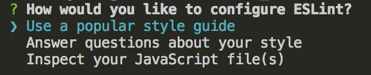

下面以前两种为例。

#### 使用流行风格

我们选择 `Use a popular style guide`，即使用一个流行的风格。

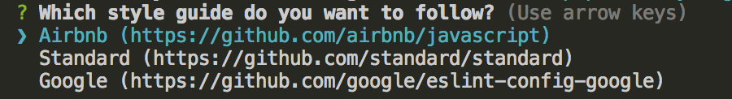

并进一步选择 Airbnb，之后会继续回答一些问题，包括是否使用 React、以及当前 ESLint 版本是否和所选 ESLint Config 版本相符等问题。

在完成依赖安装后，会发现根目录下生成了一个 `.eslintrc.js` 文件。其内容如下：

```
module.exports = {
    "extends": "airbnb-base"
};
```

#### 根据问答自动生成

我们选择 `Answer questions about your style`，即用户通过回答一些问题，来生成一个合适的配置。

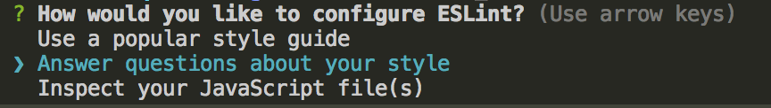

接着会让我们选择使用的 ES 版本。

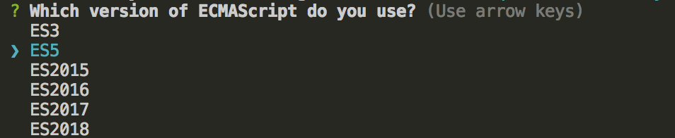

我们选择 ES2018。

接着会询问是否使用 ES6 modules

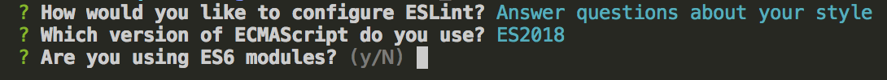

我们选择 No。

接着询问宿主环境，可以选择 Browser、Node 二者。

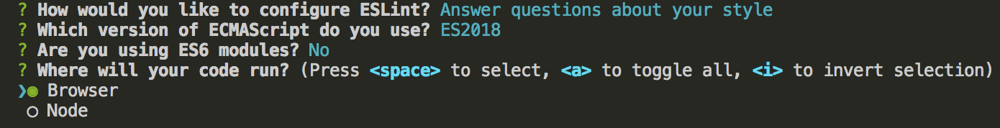

我们选择 Node。

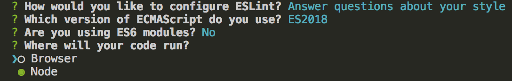

是否使用 JSX。

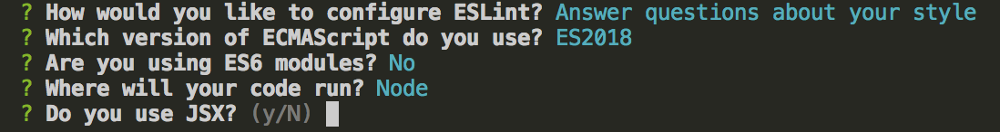

我们选择 No。

接着询问缩进方式和引号选择，我们选择空格和 Single。

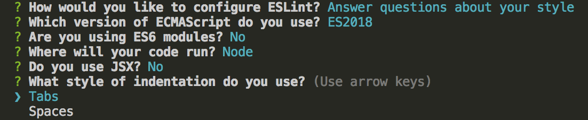

询问终端，按需选择即可，此处选择 Unix。

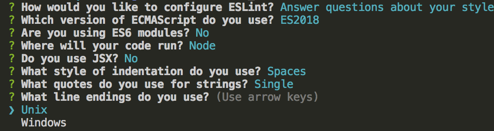

询问是否要求分号，此处选择需要。

最后选择配置文件格式，此处选择 JavaScript。

最终那个配置如下。

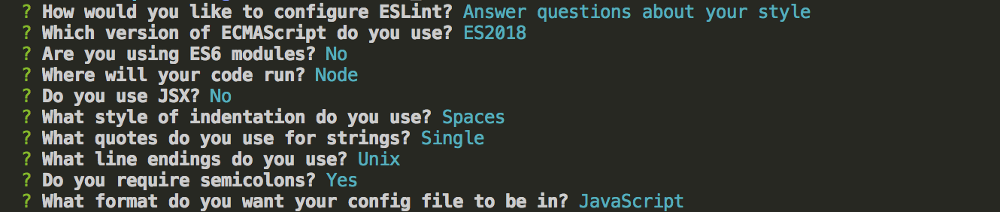

确认后生成配置文件 `.eslintrc.js`，其内容如下：

```
module.exports = {
    "env": {
        "es6": true,
        "node": true
    },
    "extends": "eslint:recommended",
    "parserOptions": {
        "ecmaVersion": 2018
    },
    "rules": {
        "indent": [
            "error",
            4
        ],
        "linebreak-style": [
            "error",
            "unix"
        ],
        "quotes": [
            "error",
            "single"
        ],
        "semi": [
            "error",
            "always"
        ]
    }
};
```

#### 检查源文件自动生成

> 此处省略

#### 比较

两种生成方式，第一种很方便，可以直接复用现有代码风格方案，但却是黑盒，第二种虽然繁琐，但可从生成的配置文件进一步研究 ESLint。

### 配置详解

`.eslintrc.js` 输出了一个配置对象。以上面通过问答方式生成的配置文件为例。

#### env

表示声明了一组预定义的全局变量。此处选择了 Node，那么浏览器下的全局变量如 window 的使用就会提示有误，而 require 则没问题。

#### extends

继承另一个配置文件。其属性可以是字符串，也可以是字符串数组（每个配置继承它前面的配置）

#### rule

启用额外的规则，但不限于此。

#### parserOptions


### 高级配置

- 插件配置

由于 Node.js 的 require 函数的行为，全局安装的 ESLint 实例只能使用全局安装的 ESLint 插件，本地安装的版本，只能用 本地安装 的插件。不支持混合本地和全局插件。